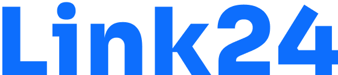
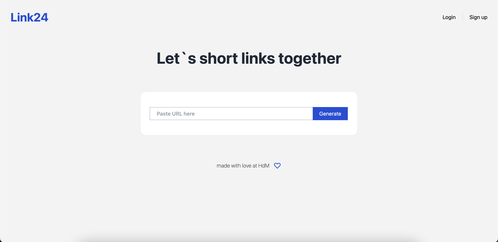
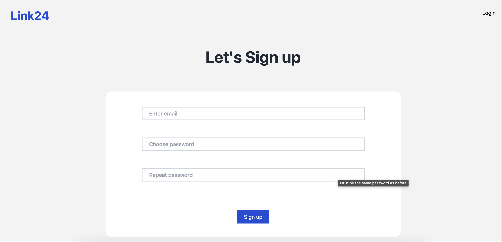

<div id="top"></div>

<!-- PROJECT LOGO -->
<br />
<div align="center">
  <a href="https://gitlab.mi.hdm-stuttgart.de/mwa/ss22/saturn">
    
  </a>
  
  <p align="center">
    Userfriendly Link shortener with additional functions.
    <br />
  </p>
</div>

<!-- TABLE OF CONTENTS -->
<details>
  <summary>Table of Contents</summary>
  <ol>
  <li>
      <a href="#team">Team</a>
    <li>
      <a href="#about-the-project">About The Project</a>
      <ul>
        <li><a href="#built-with">Built With</a></li>
      </ul>
    </li>
    <li>
      <a href="#getting-started">Getting Started</a>
      <ul>
        <li><a href="#prerequisites">Prerequisites</a></li>
        <li><a href="#installation">Installation</a></li>
      </ul>
    </li>
    <li><a href="#api-documentation">Api Documentation</a></li>
    <li><a href="#usage">Usage</a></li>
    <li><a href="#contact">Contact</a></li>
  </ol>
</details>

## Team: 
- Nicole Zeh ([nz015](https://gitlab.mi.hdm-stuttgart.de/nz015)) - UI/UX
- Jann Huschka ([jh259](https://gitlab.mi.hdm-stuttgart.de/jh259)) - UI/UX/Frontend
- David Hoffmann ([dh100](https://gitlab.mi.hdm-stuttgart.de/dh100)) - Frontend
- Dennis Sebastian Schmidt ([dg085](https://gitlab.mi.hdm-stuttgart.de/dg085)) - Backend
- Joel Dettinger ([jd087](https://gitlab.mi.hdm-stuttgart.de/jd087)) - Backend

## About the Project: 


A Link Shortener with a clear UI and Account Authentification. 
The User has additional Functions if he is logged in:

### If the User is not logged:
- Create a Shortened Link with a random generated Slug
- Expire Date is 30 Days

### If the User is logged in: 
- History of created Links
- Custom Slug for shortened Link
- Editing/Deleting created links
- Set custom Expiration date
- See View Counter on Shortened Link

<p align="right">(<a href="#top">back to top</a>)</p>

### Built With

Our project consists of three mircoservices that are communicate with each other and use different Frameworks.

#### **Frontend**

* [Next.js](https://nextjs.org/)
* [React.js](https://reactjs.org/)
* [tailwindcss](https://tailwindcss.com/)
* [Cypress](https://www.cypress.io//) (Testing)


#### **Backend**
* [node.js](https://nodejs.org/)
* [express.js](https://expressjs.com/)
* [JsonWebToken](https://jwt.io/)
* [bcrypt](https://www.npmjs.com/package/bcrypt)
* [mongoose](https://mongoosejs.com/)
* [jest](https://jestjs.io/) (Testing)
* [supertest](https://www.npmjs.com/package/supertest) (Testing)

#### **Database**
* [mongoDB](https://www.mongodb.com/)

#### **Wireframe**
* [Figma](https://www.figma.com/)

<p align="right">(<a href="#top">back to top</a>)</p>

<!-- GETTING STARTED -->
## Getting Started

The project can be either run localy with node.js (Version >12) for development by starting every service manually or in Docker by running the docker-compose. But if you run it without docker you need to provide a MongoDB Database.

### Prerequisites

In order to use node.js to start the project you need to be sure its installed. And also docker to run the containers.

[Download Node.js](https://nodejs.org/en/download/)

[Download Docker](https://www.docker.com/products/docker-desktop/)


### Installation

_Before your can run the project you need to create a **.env** File and copy the Content from the **.env.sample** File into it._

#### **Run in Docker**
1. Get latest npm version
    ```properties
    npm install npm@latest -g
    ```

2. Clone the repository
   ```properties
   git clone https://gitlab.mi.hdm-stuttgart.de/mwa/ss22/saturn.git
   ```
3. Start Docker
4. Run and built Containers with docker-compose in `./` Directory
      ```properties
   docker-compose up
   ```

This will start the following Docker Containers:

Name     | Image             | Port
-------- | ----------------- | ------
frontend | *link24_frontend* | `3000`
backend  | *link24_backend*  | `8080`
mongo    | *mongo:latest*    | `27017`

The Web App is now Locally available at: [localhost:3000](localhost:3000)

<p align="right">(<a href="#top">back to top</a>)</p>

## API Documentation

Our endpoints are divided into three Categories:
- [Authentification Documentation](documentation/api/docs/Authentication.md)
- [Links Documentation](documentation/api/docs/Links.md)
- [User Documentation](documentation/api/docs/User.md)

## Wireframe
The Design of our App was created in Figma:
[Wireframe](https://www.figma.com/file/mkkZ4g6LHRk57wl0CH6oPg/MWA?node-id=0%3A1)

## Usage

### Landing Page:

If you are not Logged in you have just the option to create a Link.

### SignUp:

SignUp and create a Account to get additional Features.

### Manage Links:

If you are logged in you can create a custom Slug for your Links or set a expire Date. You also see your history of your Links and can change the original Url or see the Views.


<p align="right">(<a href="#top">back to top</a>)</p>

<!-- CONTACT -->
## Contact

If you have Questions you can write a E-Mail to our Developers:
- Nicole Zeh: [E-Mail](mailto:nz015@hdm-stuttgart.de?subject=Contact%20Link24&body=Hello%20Nicole%2C%0D%0Ai%20want%20to%20Contact%20you%20because%20of%20your%20Awesome%20Link24%20App.)
- Jann Huschka [E-Mail](mailto:jh259@hdm-stuttgart.de?subject=Contact%20Link24&body=Hello%20Jann%2C%0D%0Ai%20want%20to%20Contact%20you%20because%20of%20your%20Awesome%20Link24%20App.)
- David Hoffmann [E-Mail](mailto:dh100@hdm-stuttgart.de?subject=Contact%20Link24&body=Hello%20David%2C%0D%0Ai%20want%20to%20Contact%20you%20because%20of%20your%20Awesome%20Link24%20App.)
- Dennis Sebastian Schmidt [E-Mail](mailto:dg085@hdm-stuttgart.de?subject=Contact%20Link24&body=Hello%20Dennis%2C%0D%0Ai%20want%20to%20Contact%20you%20because%20of%20your%20Awesome%20Link24%20App.)
- Joel Dettinger [E-Mail](mailto:jd087@hdm-stuttgart.de?subject=Contact%20Link24&body=Hello%20Joel%2C%0D%0Ai%20want%20to%20Contact%20you%20because%20of%20your%20Awesome%20Link24%20App.)

Project Link: [GitLab](https://gitlab.mi.hdm-stuttgart.de/mwa/ss22/saturn)

<p align="right">(<a href="#top">back to top</a>)</p>


