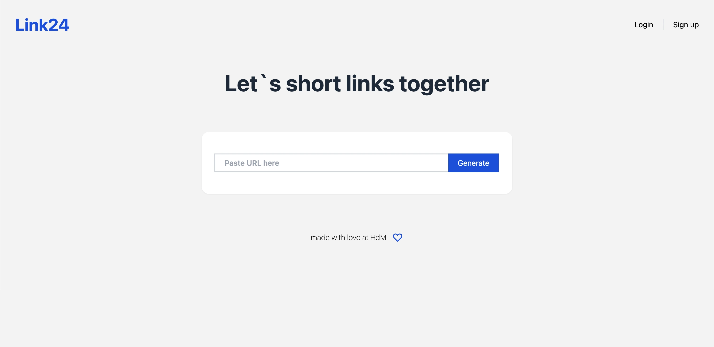
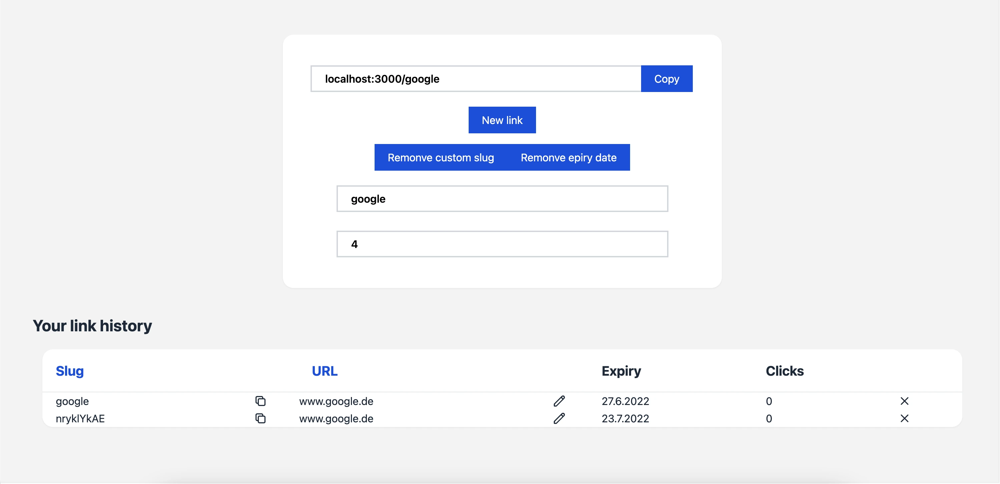
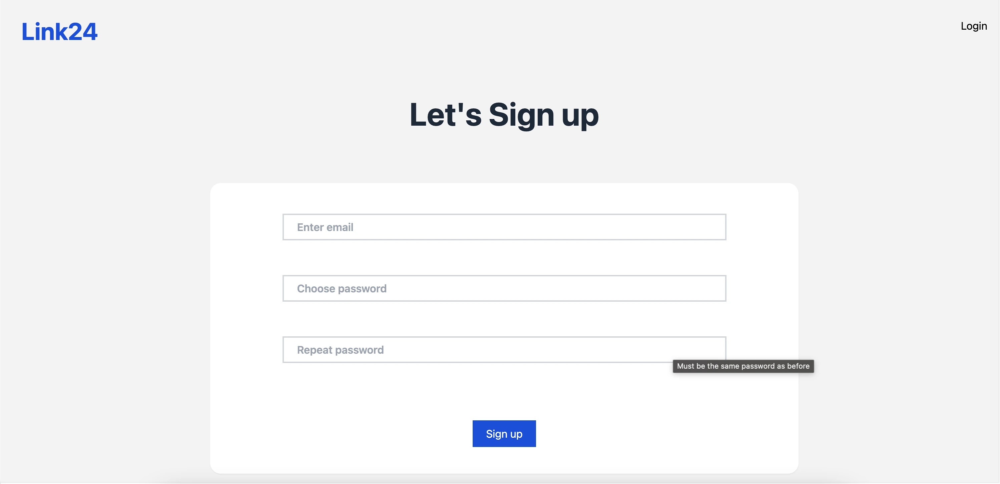

<!-- portfolio:date=2022-06-01 -->

[English](README.md) · [Deutsch](README.de.md)

# Link24 — Full-Stack URL Shortener

A comprehensive full-stack URL shortening service designed for both anonymous and registered users. While anonymous users can quickly generate temporary short links, registered users unlock a personal dashboard with link history, custom slugs, expiration date control, and click tracking. The project is architected as a decoupled system: a Next.js frontend, a Node.js/Express REST API, and a MongoDB database, all containerised with Docker.

## Screenshots

  
  
  

### Key Features

- **User Authentication:** Secure registration and login with JWT and bcrypt password hashing.
- **Public Link Shortening:** Anonymous users can create short links with a random slug and a 30-day default expiration.
- **Authenticated Dashboard:** Full history of all created links for logged-in users.
- **Custom Slugs & Expiration:** Users define human-readable slugs and custom expiration periods.
- **CRUD Operations:** Full create, read, update, and delete for personal links.
- **Click Tracking:** Counts and displays click statistics per short link.

### Technical Highlights

The backend is a RESTful API built with Node.js and Express.js, following a service-oriented architecture. Mongoose manages MongoDB data models; MongoDB's TTL index on `expiresAt` automates expired link deletion. The frontend is Next.js with Tailwind CSS and Cypress end-to-end tests. A GitLab CI pipeline runs backend (Jest/Supertest) and frontend tests on every push. The full stack is orchestrated with Docker Compose.

### Outcome

A fully self-contained project demonstrating modern full-stack and DevOps practices — secure REST API design, containerised multi-service orchestration, and automated CI/CD. The most valuable takeaway was implementing the complete pipeline from code commit to verified build entirely through Docker and GitLab CI.
